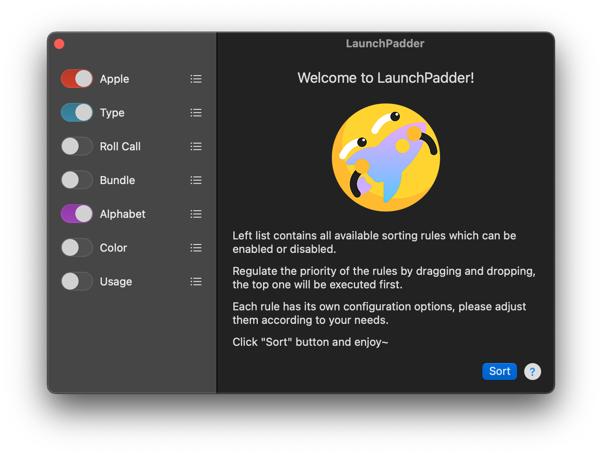
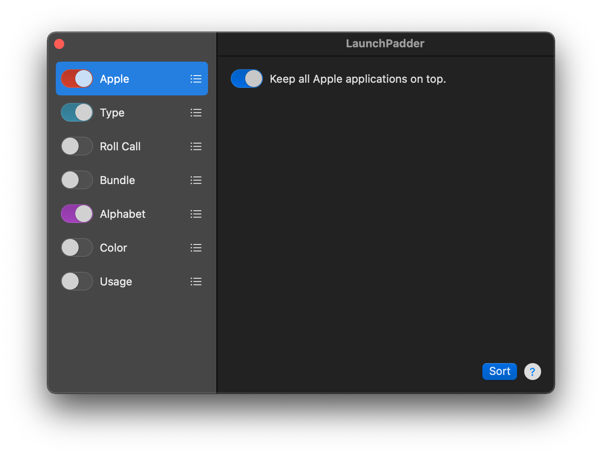
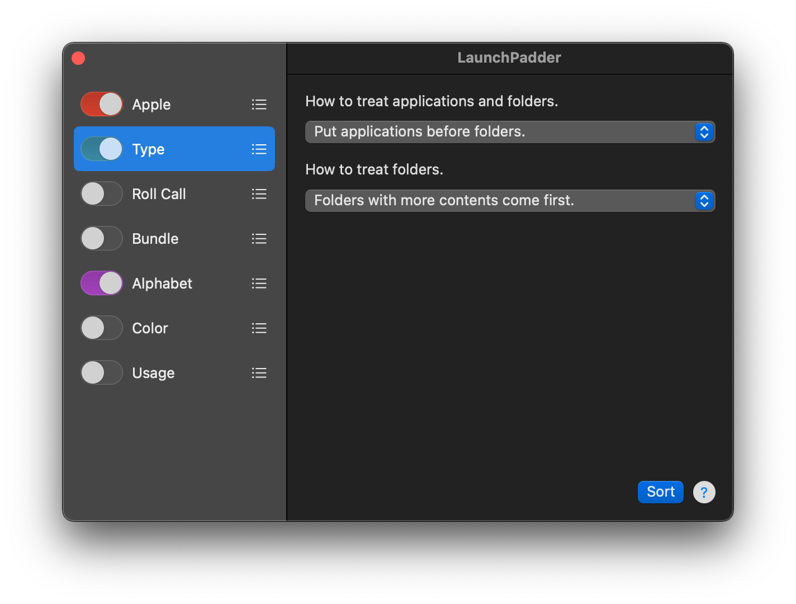
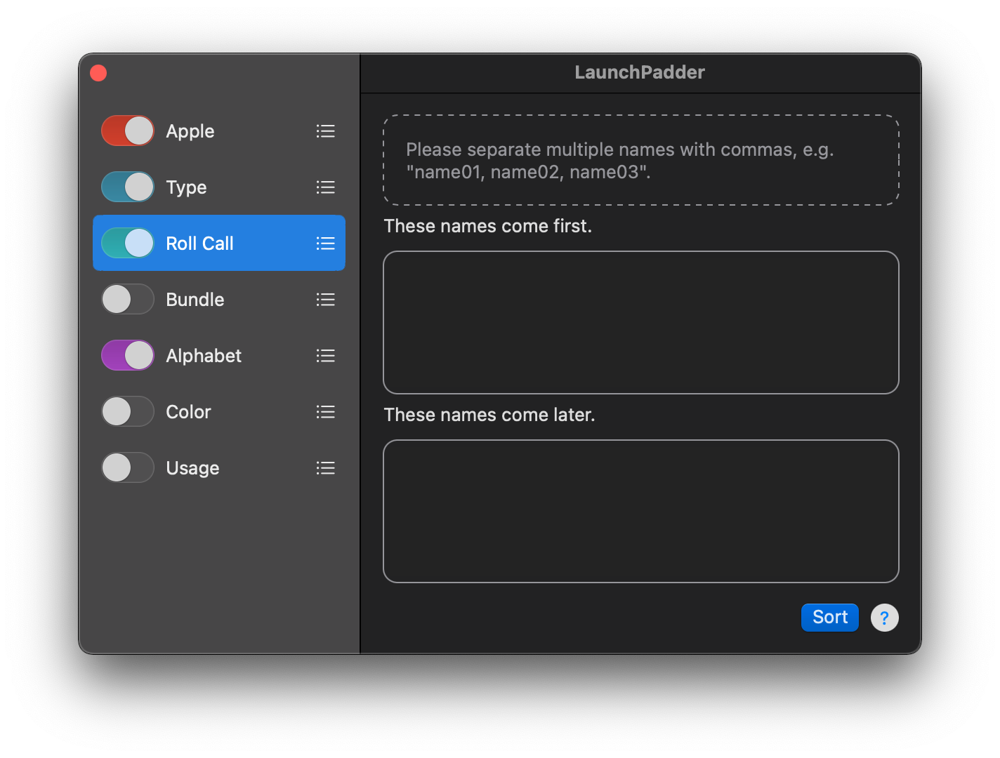
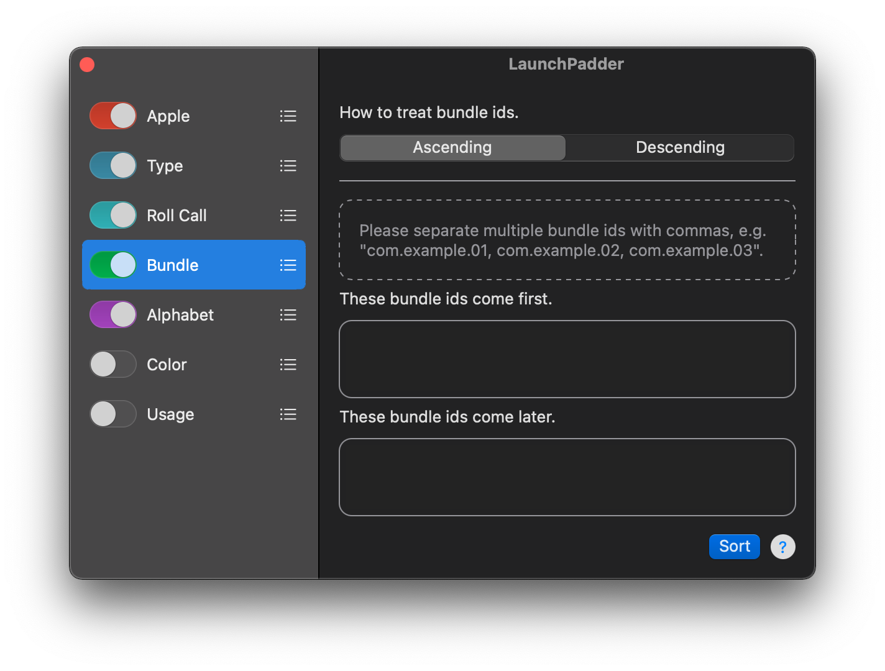
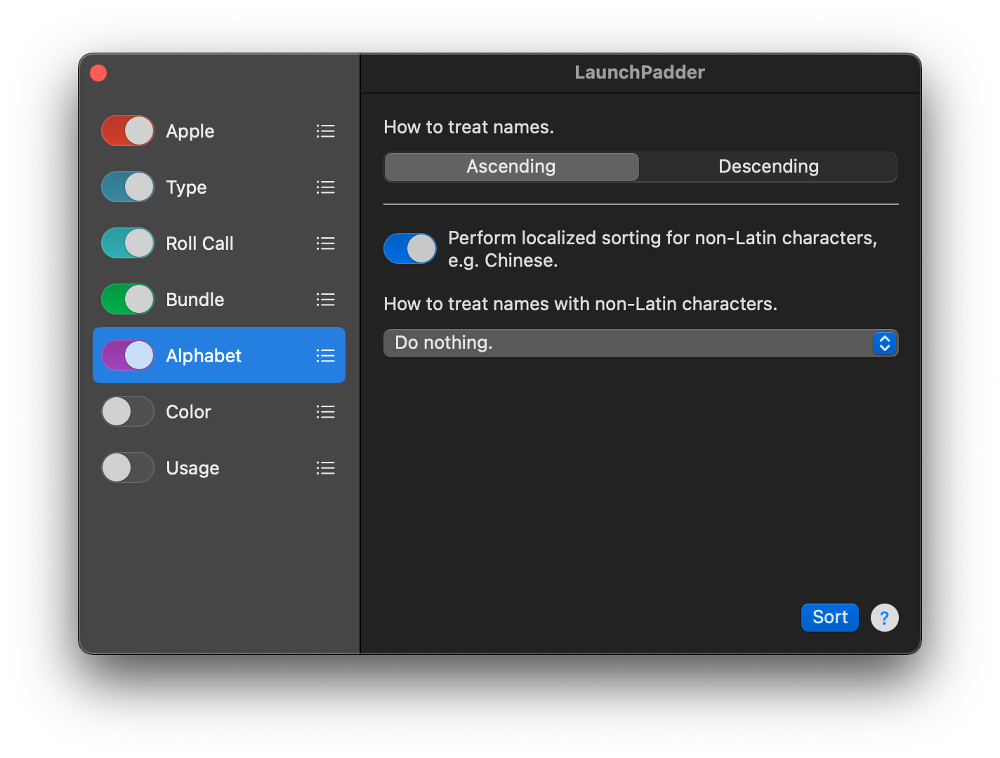
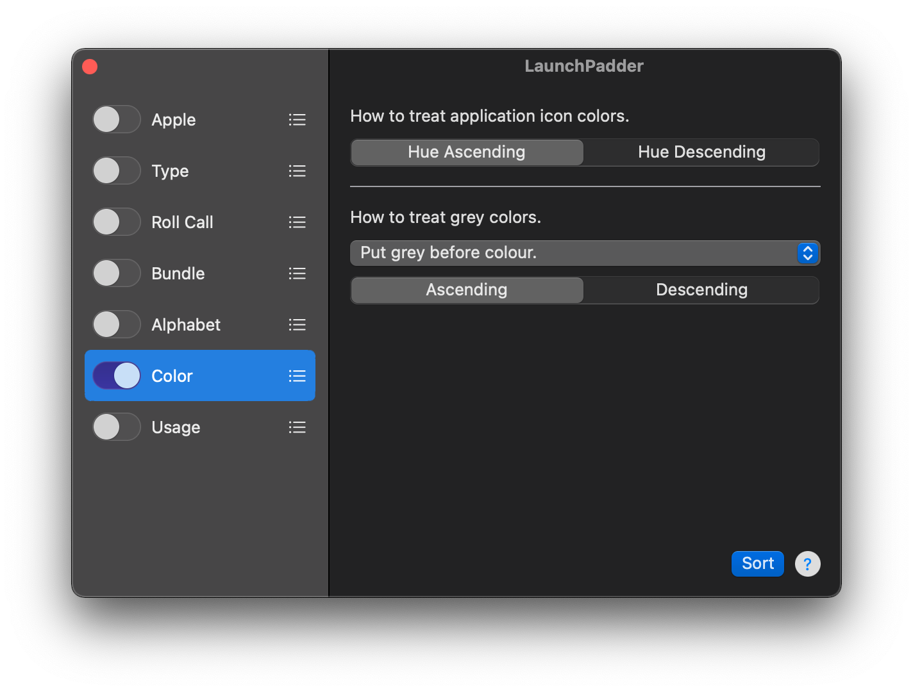
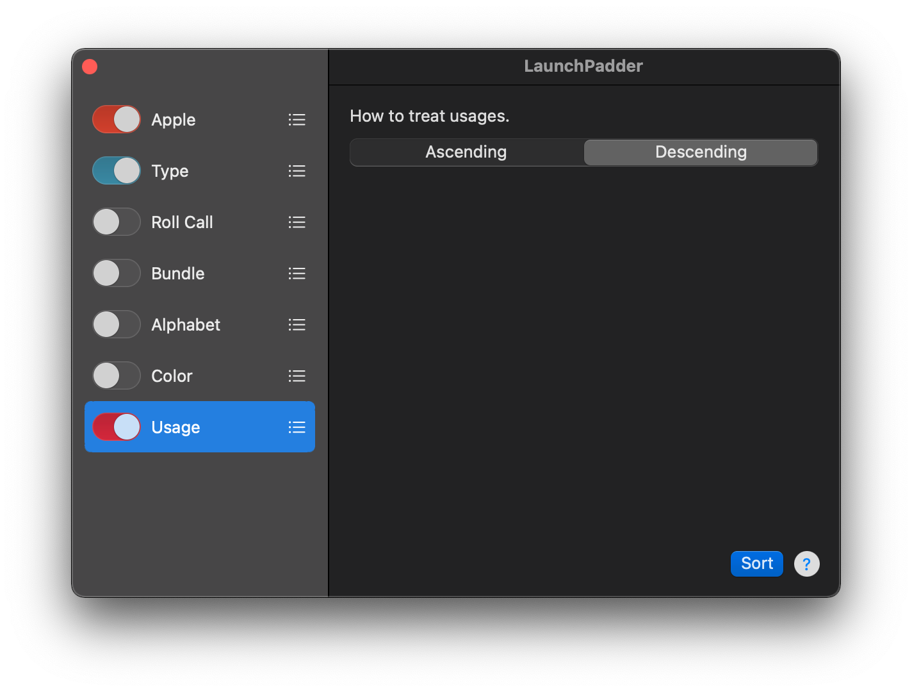
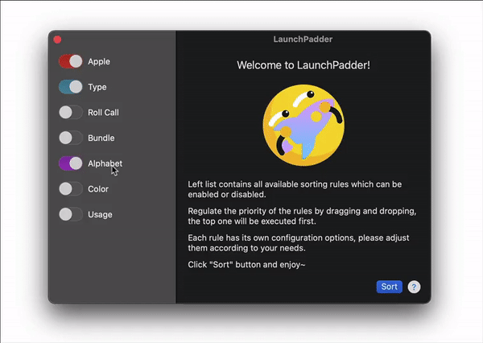

# LaunchPadder

[Simplified Chinese](README_zh-Hans.md)

## Notice

This is an introduction and feedback repository for LaunchPadder which is not open source software.

## About



**LaunchPadder** is a free macOS LaunchPad tool that organizes and sorts apps and folders on LaunchPad according to certain rules.

Sometimes LaunchPad does not display installed application icons properly, or still shows deleted application icons even after restarting the system. At this point we need to reset it, for example using the following command.

```bash
defaults write com.apple.dock ResetLaunchPad -bool true; killall Dock
```

In earlier LaunchPad versions, the reset action automatically arranged the app’s icons alphabetically, but in newer versions the arrangement is based on UUID, which creates a very confusing layout.

To solve this problem, I wrote LaunchPadder.

## Features

Currently LaunchPadder supports a variety of sorting rules, including sorting by the alphabet of the application title, sorting by application bundle group (i.e. applications from the same developer are grouped together), sorting by color of application icon and more.

* support alphabetical sorting of Latin characters and Non-Latin characters
* support sorting according to the color information of application icons
* support for putting Apple apps to the front
* support sorting by folder contents
* support placing objects matching the specified strings at the beginning or end
* support grouping and sorting by application bundle id
* support sorting by application usage
* support drag and drop to adjust the priority of rules

## Rules

### Default


Default settings include Apple, Type, and Alphabet rules, which will prioritize Apple objects and alphabetize all objects. It can basically meet most of the automatic sorting needs.

### Apple Rule


Apple stay first page 🙂

* Keep all Apple applications on top.

### Type Rule


Do some sorting for applications and folders.

* How to treat applications and folders.
    * Put applications before folders.
    * Put applications after folders.
    * Do nothing.

* How to treat folders.
    * Folders with more contents come first.
    * Folders with fewer contents come first.
    * Do nothing.

### Roll Call Rule


Specify some names, objects with the same name will be fixed at the beginning or end.

* These names come first.

* These names come later.

### Bundle Rule


Specify some bundle ids, objects with the same bundle id will be fixed at the beginning or end.

* How to treat bundle ids.
    * Ascending
    * Descending

* These bundle ids come first.

* These bundle ids come later.

### Alphabet Rule


Sorts alphabetically with support for localized characters.

* How to treat names.
    * Ascending
    * Descending

* Perform localized sorting for non-Latin characters, e.g. Chinese.

* How to treat names with non-Latin characters.
    * After names contain only Latin characters.
    * Before names contain only Latin characters.
    * Do nothing.

### Color Rule


Sort based on the color information of the application icon. It is recommended to enable this rule separately for better presentation effect.

* How to treat application icon colors.
    * Hue Ascending
    * Hue Descending

* How to treat grey colors.
    * Put grey before colour.
    * Put grey after colour.
    * Do nothing.

* Order
    * Ascending
    * Descending

### Usage Rule (Experimental Feature)


Sort by app usage.

* How to treat usages.
    * Ascending
    * Descending

### Rule Priority

According to your needs, you can enable or disable the rules, you can also drag and drop to adjust the priority of the rules.



## Requirement

OS Require: macOS 11.0+

Support x86_64(Intel) and arm64(Apple Silicon) architectures.

## Downloads

https://molayc.com/blog/2022/04/07/launchpadder/#downloads

If you find any problems, please open an issue.

## Donate

<a href="https://www.buymeacoffee.com/molay" target="_blank" rel="noopener"></a>

