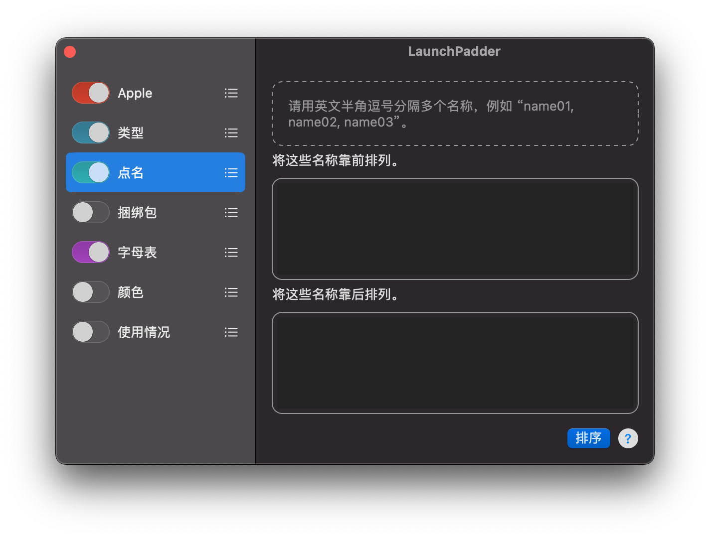
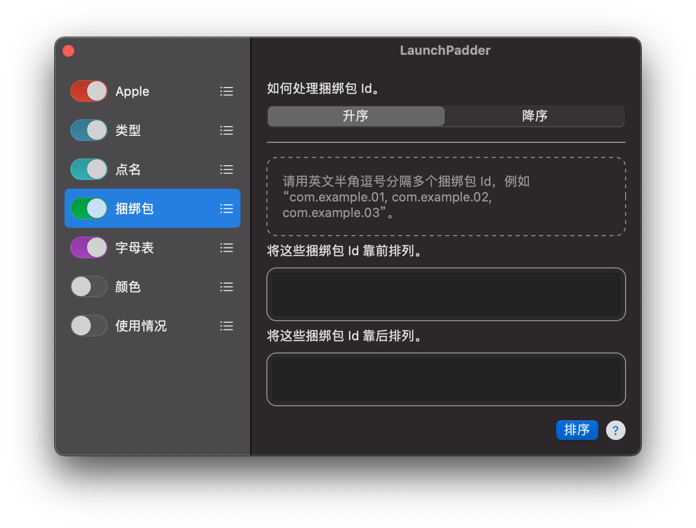
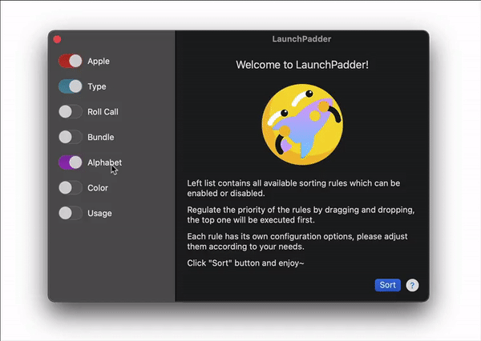

# LaunchPadder

[English](README.md)

## 提示

这是非开源软件 LaunchPadder 的介绍和反馈信息仓库。

## 关于


**LaunchPadder** 是一款免费的 macOS LaunchPad 工具，可通过一定的规则对 LaunchPad 上的应用程序 Icon 和文件夹进行组织和排序。

有时，LaunchPad 会出现一些显示问题，如不能正确地显示已安装应用程序的 Icon，或是依旧显示已删除应用程序的 Icon，且重启操作系统问题依旧。在这种情况下，我们需要重置 LaunchPad，比如使用以下的命令。

```bash
defaults write com.apple.dock ResetLaunchPad -bool true; killall Dock
```

在较早版本的 LaunchPad 中，重置操作会自动将应用程序以字母顺序排列，但在较新的版本中，它采用了 UUID 作为排序依据，这会造成非常混乱的布局。

为了解决这个问题，我编写了 LaunchPadder。

## 特性

目前 LaunchPadder 支持多种排序规则，包括依据应用程序标题的字母顺序排序，依据应用程序捆绑包信息排序（将相同开发商的应用程序放在一起），依据应用图标颜色信息排序等。

* 支持对拉丁字符以及非拉丁字符进行字母顺序排序
* 支持根据应用程序图标的颜色信息进行排序
* 支持将 Apple 应用程序排在最前
* 支持按文件夹内容排序
* 支持将与指定字符串匹配的对象放置在开头或结尾
* 支持按应用程序捆绑包 Id 进行分组和排序
* 支持按应用程序使用情况排序
* 支持以拖放的方式调整规则的优先级

## 规则

### 默认


默认设置包括 Apple、类型和字母表规则，将优先考虑 Apple 对象并按字母顺序排列所有对象。基本上可以满足大部分的自动整理需求。

### Apple 规则


Apple 得留在第一页 🙂

* 将 Apple 开发的应用程序靠前排列。

### 类型规则


对应用程序和文件夹的排序方法进行设置。

* 如何处理应用程序和文件夹。
    * 将应用程序放在文件夹之前。
    * 将应用程序放在文件夹之后。
    * 不作处理。

* 如何处理文件夹。
    * 内容较多的文件夹靠前.
    * 内容较少的文件夹靠前.
    * 不作处理。

### 点名规则


指定一些名称，具有相同名称的对象将被固定在开头或结尾。

* 将这些名称靠前排列。

* 将这些名称靠后排列。

### 捆绑包规则


指定一些捆绑包 Id，具有相同捆绑包 Id 的对象将被固定在开头或结尾。

* 如何处理捆绑包 Id.
    * 升序
    * 降序

* 将这些捆绑包 Id 靠前排列。

* 将这些捆绑包 Id 靠后排列。

### 字母表规则


依据字母顺序对对象进行排序，支持非拉丁字符的本地化字符集。

* 如何处理名称。
    * 升序
    * 降序

* 对非拉丁字符执行本地化排序，例如中文。

* 如何处理包含非拉丁字符的名称。
    * 置于只包含拉丁字符的名称之后。
    * 置于只包含拉丁字符的名称之前。
    * 不作处理。

### 颜色规则


根据应用程序图标的颜色信息进行排序。为达到最好的呈现效果，建议单独启用此规则，或配合 Apple、类型规则使用。

* 如何处理应用程序的图标颜色。
    * 色调升序
    * 色调降序

* 如何处理灰色。
    * 将灰色放在彩色之前。
    * 将灰色放在彩色之后。
    * 不作处理。

* 灰度的排序。
    * 升序
    * 降序

### 使用情况规则（实验性）


按应用程序的使用情况排序。

* 如何处理使用情况数据。
    * 升序
    * 降序

### 规则优先级

根据你的需要，你可以启用或禁用规则，也可以通过拖放来调整规则的优先级。



## 环境要求

系统需求：macOS 11.0+

支持 x86_64(Intel) and arm64(Apple Silicon) 硬件架构。

## 下载

https://molayc.com/blog/2022/04/07/launchpadder/#downloads

如发现任何问题，欢迎提交。

## 捐赠

<a href="https://www.buymeacoffee.com/molay" target="_blank" rel="noopener"></a>

